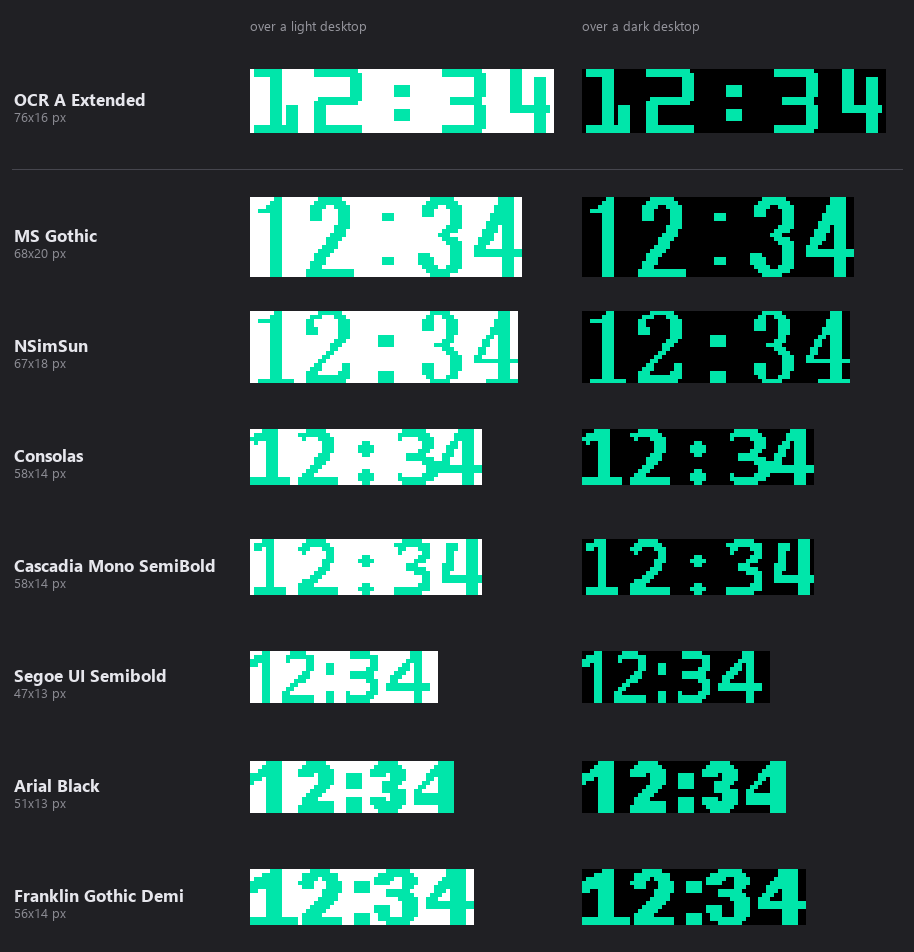

# topclock

After searching for a very simple clock that will only show time on the desktop,
I am bewildered to see there is none. Since I don't know rust, I decided to **vibe-code**
one to blend in with the latest trend.

A minimal always-on-top clock for Windows. It draws `HH:MM` directly onto the
desktop with no window frame, no backdrop, and no padding -- just the digits,
floating wherever you put them.

The window is sized to the exact pixel bounds of the glyphs, so it can sit flush
against a screen edge, and its transparent area is click-through: everything
behind the clock stays usable, and the digits themselves are the only thing you
can grab.

## Requirements

- Windows
- Rust 1.85 or newer (the crate uses edition 2024; developed on 1.98)

The only dependency is the `windows` crate, pinned to 0.58 because windows-rs
shifts parameter types between versions.

## Build

```
cargo build --release
```

The result is a single self-contained executable at
`target\release\topclock.exe`, about 172 KB. The release profile optimizes for
size (`opt-level = "z"`, LTO, one codegen unit, symbols stripped, panics abort);
roughly 38 KB of the total is the embedded icon.

For a debug build, use `cargo build` and run `target\debug\topclock.exe`.

## Icon

Rust has no icon support of its own. On Windows the icon lives in the
executable's `.rsrc` section as an ordinary Win32 resource, and Explorer
displays whichever icon has the lowest resource ID. `build.rs` embeds
`assets\topclock.ico` using the `winresource` build-dependency, which generates
the `.rc`, locates the Windows SDK's `rc.exe` and emits the link flags. Nothing
from that crate ends up in the binary; only the icon bytes do.

If the `.ico` is missing or no resource compiler is installed, the build prints
a warning and produces an executable with the default icon rather than failing.

This is the *executable* icon, seen in Explorer, on shortcuts and when pinned.
It is unrelated to the window icon (`WNDCLASSW::hIcon`), which would be pointless
here: the clock is a `WS_EX_TOOLWINDOW` with no titlebar and no taskbar or
Alt-Tab presence.

### Regenerating it

`tools\make_icon.py` draws the icon from the same colors and font as the clock,
so the two stay in step if you change the palette. It needs Pillow.

```
python tools\make_icon.py
```

It writes six sizes. Each is drawn at its own scale rather than downsampled from
one bitmap, so the 16px entry stays legible: sizes from 32px up show two rows of
digits, and 16px shows one. The 64px and larger entries are PNG-compressed,
which Windows has supported since Vista -- as uncompressed DIBs, the 128px entry
alone would be 67 KB, more than half the executable.

## Run

Launch the executable. There is no console window and no tray icon. The clock
appears in the top-right corner of the primary screen.

| Action | Result |
| --- | --- |
| Left-click and drag *on the digits* | Move the clock |
| Middle-click *on the digits* | Open the settings file |
| Right-click *on the digits* | Quit |
| Escape | Quit (the window must have focus -- click it first) |

Dragging and clicking only register on the digits. The transparent space around
and between them passes the mouse through to whatever is underneath, so the
glyph strokes are the target. Grabbing a stroke is more reliable than aiming at
the middle of the colon.

## Configuration

On first run, topclock writes `topclock.ini` with the defaults and a comment for
every key. Edit it and restart the clock; the file is read once at startup.

Delete the file to regenerate it.

```ini
[clock]
fg = #00E6AA
bg = #0C0C10
bg_alpha = 0

font = Consolas
font_size = 26
weight = 700
antialias = off

pad = 0

monitor = 0
margin_x = 0
margin_y = 0
```

| Key | Default | Meaning |
| --- | --- | --- |
| `fg` | `#00E6AA` | Digit color, written `#RRGGBB` |
| `bg` | `#0C0C10` | Backdrop color. Only visible when `bg_alpha > 0`, but it is also what the antialiased glyph edges blend toward, so keep it near your intended backdrop |
| `bg_alpha` | `0` | Backdrop opacity, 0-255. See the note below |
| `font` | `Consolas` | Any installed font family |
| `font_size` | `26` | Cell height in pixels. Digits render at roughly half of it, and the window resizes to fit |
| `weight` | `700` | 400 is normal, 700 is bold |
| `antialias` | `off` | Smooth the glyph edges. `off` makes every pixel fully on or fully off. Accepts on/off, true/false, yes/no, 1/0 |
| `pad` | `0` | Transparent border around the digits, in pixels |
| `monitor` | `0` | Which display to start on. 0 is the primary; 1, 2, 3 ... match the numbers in Settings > System > Display |
| `margin_x` | `0` | Gap from the right edge of that monitor's work area, at startup only |
| `margin_y` | `0` | Gap from its top edge, at startup only |

Colors are ordinary `#RRGGBB`. Win32 actually wants `COLORREF`, which is
`0x00BBGGRR`, but that flip is handled internally and never surfaces in the ini.

A value that fails to parse keeps its default rather than stopping the clock, so
a typo in a color costs you nothing. Comments must be on their own line;
trailing comments after a value are not stripped.

### The bg_alpha tradeoff

`bg_alpha = 0` is the default and does two things at once: it makes the backdrop
fully transparent, and it makes those pixels click-through, because Windows
hit-tests a layered window against its alpha channel. That is what confines
dragging to the digits.

Any value above 0 makes the entire window rectangle solid to the mouse. It also
gives you a visible plate: around 40 reads as smoked glass and helps legibility
over a bright desktop, while 120 is clearly a translucent tile.

### Sharpness, and why antialias defaults to off

At 14 pixels tall the glyphs are small enough that antialiasing is a visible
part of the design rather than a subtlety, and at that size it costs more than
it gives. The default `antialias = off` uses `NONANTIALIASED_QUALITY`, and
because the backdrop is transparent that means every pixel ends up either fully
the glyph color or fully absent -- measured on a real render, zero pixels of any
intermediate value, against 191 with antialiasing on. Hard, digital edges.

Turn it on for smoother diagonals and curves. That trade gets better as
`font_size` grows and each glyph has more pixels to work with; at the default
size it mostly buys a soft halo.

It also sidesteps a quirk of small-size type. Round digits are drawn slightly
taller than flat ones so they look the same size to the eye, an old type-design
compensation called overshoot: Consolas Bold measures 132 units tall on `0 3 6 8`
against 128 on `1 4 7`. At this size that 1.5% is about a quarter of a pixel, so
antialiased it becomes a faint partly-covered row that only round digits have,
which reads as the fill spilling past the curve. A binary mask cannot represent
a quarter pixel, so the effect disappears.

The window resizes itself accordingly: the measured ink box is 58x14 by
default and 58x16 with antialiasing on, which adds the soft rows back.

If you switch fonts, note that Win32 silently substitutes a similar face when
the family name does not match anything installed, rather than reporting an
error -- so a typo looks like "my new font changed nothing". Use the exact
family name as Windows lists it, `Segment7` for instance.

### Suggested fonts

At the default settings, over a light and a dark desktop:



**`OCR A Extended` is the pick, by some distance.** It was designed in 1968 to
be read by machines, which gave it a constant stroke width and rectilinear,
maximally distinguishable forms -- exactly the properties that land on whole
pixels. It is the only font here that barely notices the `antialias` setting:
49 partially covered pixels with antialiasing on, against 192 for Consolas, and
its box does not change size between the two modes. For a clock you glance at
rather than read, unambiguous beats elegant.

```ini
font = OCR A Extended
```

The rest, all good at this size:

| Font | Size | Why |
| --- | --- | --- |
| `OCR A Extended` | 76x16 | Machine-readable by design; effectively immune to the antialias setting |
| `MS Gothic` | 68x20 | Embedded bitmap strikes, so glyphs are hand-placed on the grid rather than fitted |
| `NSimSun` | 67x18 | Same trick, a little narrower and lighter |
| `Consolas` | 58x14 | The default. Heavily hinted for small sizes, and the most compact of the monospaced options |
| `Cascadia Mono SemiBold` | 58x14 | Consolas footprint, slightly more modern shapes |
| `Segoe UI Semibold` | 47x13 | The smallest footprint here, if you want the clock to nearly disappear |
| `Arial Black` | 51x13 | Heavy and short; the most presence per pixel |
| `Franklin Gothic Demi` | 56x14 | Bold without Arial Black's density |

Sizes vary more than you would expect for one `font_size = 26`: across the full
gallery the same setting produces anything from a 43 to an 89 pixel wide clock.
For something parked in a screen corner that matters, so the widths are listed
above. `OCR A Extended` at `font_size = 20` lands close to Consolas at 26.

### The full gallery

Every font installed on the machine that generated these, drawn as `12:34`,
four ways each: antialiasing off and on, over a light and a dark backdrop. The
sheets are long, so they are linked rather than embedded.

| Sheet | Fonts |
| --- | --- |
| [1](docs/fonts/gallery-01.png) | AcadEref ... Broadway |
| [2](docs/fonts/gallery-02.png) | Brush Script MT ... CaskaydiaCove NFM SemiBold |
| [3](docs/fonts/gallery-03.png) | CaskaydiaCove NFM SemiLight ... Footlight MT Light |
| [4](docs/fonts/gallery-04.png) | Forte ... Javanese Text |
| [5](docs/fonts/gallery-05.png) | Jokerman ... MS Reference Sans Serif |
| [6](docs/fonts/gallery-06.png) | MS Reference Specialty ... ScriptC |
| [7](docs/fonts/gallery-07.png) | ScriptS ... Swis721 BlkEx BT |
| [8](docs/fonts/gallery-08.png) | Swis721 BlkOul BT ... Yu Gothic UI Semilight |

Both backdrops are worth checking. The clock is transparent, so a font that
reads well on a dark desktop can lose its thinner strokes on a light one, and
the mint default is much lower contrast against white than against black.

What the gallery mostly shows is **hinting**, not letterforms. Faces designed
for small sizes -- UI and code fonts like Consolas, Cascadia Mono, Segoe UI,
Tahoma -- carry instructions that snap stems and crossbars onto whole pixels,
which is exactly what a no-antialiasing render needs. Display and novelty faces
have little or none, so their strokes land wherever they land and break up.
Counterintuitively that includes segmented "digital" fonts, which look like they
should suit a pixel grid but are usually unhinted.

### Regenerating the gallery

```
python tools\make_font_gallery.py
```

It reflects the fonts on whichever machine runs it, so regenerate to see your
own. It needs Pillow.

Rather than launching the app once per font, roughly 1500 times, the script
calls the same GDI entry points the app does -- `CreateFontW` with the same
height, weight and quality, `TextOutW` into a 32bpp DIB, the same ink
measurement and the same coverage-to-alpha tint. That was checked against real
captures of the running clock and matches pixel for pixel, zero differing
pixels in both antialias states.

### Why there is no width or height setting

The window measures itself from the glyphs (see below), so a fixed width or
height would only reintroduce the transparent padding the design removes -- and
with it a band of invisible mouse-catching area around the digits. `font_size`
and `pad` are the size controls.

### One clock per monitor

topclock has no single-instance guard, so you can run one copy per display. Give
each its own config through `TOPCLOCK_CONFIG` and point them at different
monitors:

```
set TOPCLOCK_CONFIG=%APPDATA%\topclock\left.ini  && start topclock.exe
set TOPCLOCK_CONFIG=%APPDATA%\topclock\right.ini && start topclock.exe
```

`monitor` numbers match what Settings > System > Display shows, because they are
read from the display device name (`\\.\DISPLAY2`) rather than from enumeration
order, which is not the same thing. A number naming a monitor that is not
currently attached falls back to the primary display, so unplugging a screen
leaves the clock somewhere visible instead of off in unreachable coordinates.

Placement uses the monitor's work area rather than its full bounds, so the clock
does not start underneath a taskbar docked to the top or the side. With the
usual bottom taskbar the two are identical.

On mixed-DPI setups the app is not per-monitor DPI aware, so a clock on a
display with a different scaling factor than the primary is bitmap-scaled by
Windows and will look softer.

### Where the ini lives

**Middle-click the clock and it opens the file it is actually using.** That is
the quickest way to find it, and it opens the right one even when several clocks
are running from different configs. A per-user install also puts a "topclock
settings" entry in the Start Menu next to the app.

The rules below are what that resolves to. The location depends on where the
executable is installed, because a program under `Program Files` cannot write
next to itself without elevation. topclock takes the first of these that
applies:

1. The path in the `TOPCLOCK_CONFIG` environment variable, if set.
2. `topclock.ini` next to the executable, if it already exists.
3. `%APPDATA%\topclock\topclock.ini`, if it already exists.
4. Otherwise it creates one: next to the executable if that folder is writable,
   and in `%APPDATA%\topclock\` if it is not.

So a portable copy unzipped into a writable folder keeps its settings alongside
it, while an installed copy under `Program Files` puts them in the per-user
location automatically, with no elevation and nothing to configure.

## Installer

`installer\topclock.iss` builds a Windows installer with Inno Setup 6.

```
cargo build --release
iscc installer\topclock.iss
```

The result is `dist\topclock-0.3.0-setup.exe`.

`iscc` is Inno Setup's command-line compiler. Its installer does not add it to
PATH, so either put `C:\Program Files (x86)\Inno Setup 6` there yourself or call
`ISCC.exe` in that folder by full path.

It installs per-user into `%LocalAppData%\Programs\topclock` and never asks for
elevation, which suits a personal desktop utility. For machine-wide deployment,
run it with `/ALLUSERS`: that elevates and installs into `Program Files`, and
each user still gets their own settings in `%APPDATA%` on first run.

Setup offers two tasks: starting topclock when you sign in (on by default, via a
Startup shortcut) and a desktop shortcut (off by default). A running instance is
closed through Restart Manager before an upgrade overwrites the exe, since the
clock holds a lock on its own executable.

Alongside the app it installs a "topclock settings" Start Menu entry pointing at
the ini, for per-user installs only: an all-users install keeps each user's ini
under their own `%APPDATA%`, which one shared shortcut cannot point at.

Uninstalling removes the program and any `topclock.ini` sitting beside it. If
you have settings in `%APPDATA%\topclock` it asks before deleting them, and a
silent uninstall always keeps them.

The privileges question is answered on the command line rather than by a dialog.
Inno shows that dialog before the wizard starts, and shows it even under
`/VERYSILENT`, which makes an unattended install stop and wait for a click.

### Why no ini is shipped

The installer deliberately ships no `topclock.ini`. A file beside the exe wins
the config lookup, so installing one into `Program Files` would hand the user
settings they cannot edit without elevation, and their per-user file would never
be consulted. The first run creates one in the right place on its own.

## How it works

Four things are load-bearing.

**A layered window with per-pixel alpha.** The window is created with
`WS_EX_LAYERED` and its pixels are pushed with `UpdateLayeredWindow` and
`ULW_ALPHA` rather than painted in a `WM_PAINT` cycle. That is what allows a
genuinely transparent background with opaque digits on top. The alternative,
color-key transparency via `LWA_COLORKEY`, would also make the clock
click-through but offers no control over it and no antialiasing.

**The window is measured, not declared.** Font metrics only describe the *cell*
box, where ascent, internal leading and descent all reserve room for accents and
descenders that `12:34` never uses. That reserved space is exactly the padding
we want gone. So at startup topclock draws `88:88` onto a scratch canvas, scans
for the pixels that carry ink, and takes the true bounding box. The window
becomes that box, and the text draw origin is shifted to compensate -- in the
default configuration that means drawing six pixels above the window's own top
edge to cut the leading.

The default configuration comes out at 58x14 pixels. The sample is `88:88`
rather than the current time, so the box is stable: the clock never resizes or
drifts as the digits change. The cost is that narrow digits such as `1` do not
quite reach the left edge.

**Color comes from a mask, not from the drawing.** GDI text drawing ignores the
alpha channel, so drawing straight into a transparent buffer produces invisible
digits. topclock instead draws the text white-on-black to get a coverage mask,
then tints that mask with `fg` and `bg` and derives alpha from it. Deriving
coverage from a fixed white-on-black pass, rather than from the configured
colors, is what keeps every palette working -- comparing against the real colors
would collapse to zero coverage, and an invisible clock, for any pair of colors
sharing a channel value.

Because coverage is a smooth ramp, antialiased glyph edges fade to transparent
instead of carrying a dark fringe from the backdrop color.

**Grayscale antialiasing, never ClearType.** Antialiasing is off by default
(see above), but when `antialias = on` the font is created with
`ANTIALIASED_QUALITY` rather than `CLEARTYPE_QUALITY`. Subpixel antialiasing is
computed for a known background, and here the background is whatever happens to
be behind the window, so its color fringes would be tuned for a backdrop that
is not there. Grayscale keeps the edges neutral.

### Redraw behavior

A one-second timer runs, but the display only changes once a minute, so the
timer compares against the last rendered minute and skips the other 59 redraws.

## Design notes

Seconds were removed deliberately -- a ticking seconds field is distracting in a
clock meant to sit in your peripheral vision.

Double-click to cycle through colors was considered and dropped once the ini
existed. It would have needed `CS_DBLCLKS` on the window class, without which
`WM_LBUTTONDBLCLK` is never sent at all, and it would have conflicted with
dragging: `WM_LBUTTONDOWN` hands straight off to `HTCAPTION`, entering a modal
move loop that swallows the second click.
